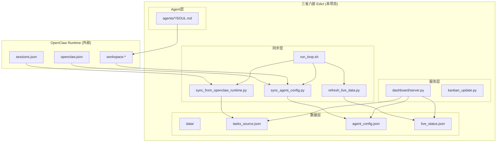
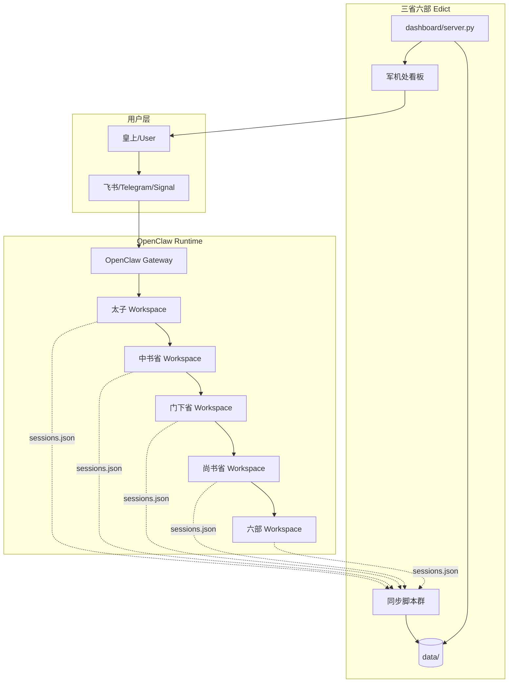
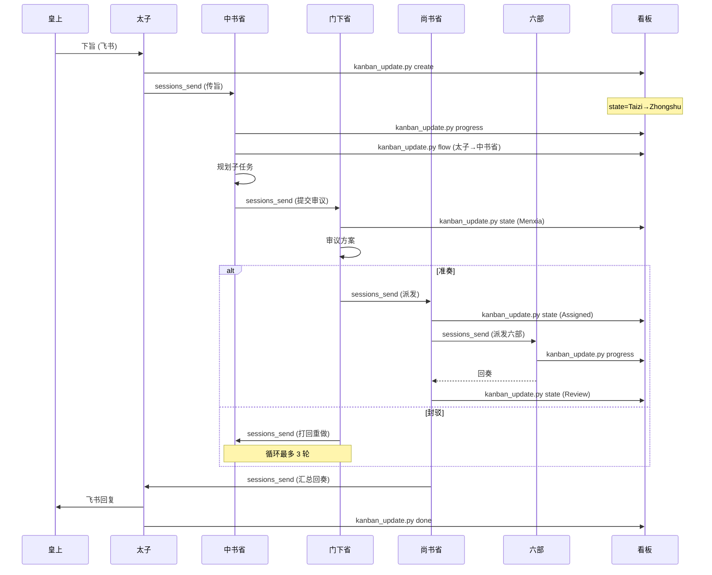

# 三省六部 Edict - OpenClaw 集成深度研究

> **报告日期**: 2026-03-14
> **仓库路径**: `/Users/roc/workspace/edict`
> **分支**: main
> **目标读者**: 开发者
> **关注点**: 与 OpenClaw 的同步与对接机制

---

## 目录

1. [Phase 1: 全局架构地图](#phase-1-全局架构地图)
2. [Phase 2: OpenClaw 集成入口与执行流程](#phase-2-openclaw-集成入口与执行流程)
3. [Phase 3: 核心同步模块深挖](#phase-3-核心同步模块深挖)
4. [Phase 4: 扩展与二次开发](#phase-4-扩展与二次开发)
5. [Phase 5: 架构图与数据流](#phase-5-架构图与数据流)
6. [附录: 关键文件索引](#附录-关键文件索引)

---

## Phase 1: 全局架构地图

### 1.1 项目概览

**三省六部 Edict** 是一个基于唐朝三省六部制度的多 AI Agent 协作系统，**必须依赖 [OpenClaw](https://openclaw.ai) 作为运行时**。

| 属性 | 值 |
|------|-----|
| **语言** | Python 3.9+ (后端) + React 18 (前端看板) |
| **核心依赖** | OpenClaw CLI (运行时) |
| **Agent 数量** | 12 个专职 Agent |
| **部署模式** | 本地部署 + Docker 可选 |
| **看板端口** | 7891 |

### 1.2 目录结构

```
edict/
├── agents/                     # 12 个 Agent 人格模板 (SOUL.md)
│   ├── taizi/SOUL.md           # 太子 · 消息分拣
│   ├── zhongshu/SOUL.md        # 中书省 · 规划中枢
│   ├── menxia/SOUL.md          # 门下省 · 审议把关
│   ├── shangshu/SOUL.md        # 尚书省 · 调度大脑
│   ├── hubu/SOUL.md            # 户部 · 数据资源
│   ├── libu/SOUL.md            # 礼部 · 文档规范
│   ├── bingbu/SOUL.md          # 兵部 · 工程实现
│   ├── xingbu/SOUL.md          # 刑部 · 合规审计
│   ├── gongbu/SOUL.md          # 工部 · 基础设施
│   ├── libu_hr/                # 吏部 · 人事管理
│   └── zaochao/SOUL.md         # 早朝官 · 情报枢纽
├── scripts/                    # 🔑 核心同步脚本
│   ├── sync_from_openclaw_runtime.py  # 会话数据同步
│   ├── sync_agent_config.py           # Agent 配置同步
│   ├── kanban_update.py               # 看板任务更新 CLI
│   ├── apply_model_changes.py         # 模型热切换
│   ├── sync_officials_stats.py        # Agent 统计同步
│   ├── refresh_live_data.py           # 实时数据刷新
│   ├── skill_manager.py               # Skill 管理
│   ├── run_loop.sh                    # 数据刷新循环
│   └── file_lock.py                   # 并发安全文件锁
├── dashboard/
│   ├── server.py               # 看板 API 服务器 (stdlib-only)
│   ├── dashboard.html          # 单文件前端
│   └── dist/                   # React 构建产物
├── data/                       # 运行时数据 (gitignored)
│   ├── tasks_source.json       # 任务池
│   ├── agent_config.json       # Agent 配置缓存
│   ├── live_status.json        # 实时状态
│   └── ...
├── edict/                      # FastAPI 后端 (v2.0)
│   ├── backend/
│   │   └── app/
│   │       ├── main.py         # FastAPI 入口
│   │       ├── api/            # API 路由
│   │       ├── models/         # 数据模型
│   │       ├── services/       # 业务服务
│   │       └── workers/        # 后台 Worker
│   └── frontend/               # React 前端
├── install.sh                  # 一键安装脚本
└── docs/
    └── task-dispatch-architecture.md  # 架构文档
```

### 1.3 模块依赖关系



---

## Phase 2: OpenClaw 集成入口与执行流程

### 2.1 OpenClaw 运行时目录结构

Edict 依赖 OpenClaw 的以下目录结构：

```
~/.openclaw/
├── openclaw.json               # 🔑 核心配置文件
│   └── agents.list[]           # Agent 注册列表
│       └── {id, workspace, model, subagents.allowAgents}
│
├── workspace-{agent_id}/       # 每个 Agent 的独立工作空间
│   ├── SOUL.md                 # Agent 人格/角色定义
│   ├── AGENTS.md               # 工作协议
│   ├── skills/                 # 技能包目录
│   │   └── {skill_name}/
│   │       └── SKILL.md        # 技能定义
│   └── scripts/                # 同步的脚本副本
│
└── agents/{agent_id}/          # Agent 注册目录
    └── sessions/
        └── sessions.json       # 🔑 会话状态数据
```

### 2.2 集成入口点

| 入口点 | 文件路径 | 功能 |
|--------|----------|------|
| **配置同步** | `scripts/sync_agent_config.py` | 读取 `openclaw.json` → `data/agent_config.json` |
| **会话同步** | `scripts/sync_from_openclaw_runtime.py` | 读取 `sessions.json` → `data/tasks_source.json` |
| **SOUL 部署** | `install.sh` + `sync_agent_config.py` | `agents/*/SOUL.md` → `~/.openclaw/workspace-*/SOUL.md` |
| **模型热切换** | `scripts/apply_model_changes.py` | 修改 `openclaw.json` 中的 model 配置 |

### 2.3 数据同步执行流程

```mermaid
sequenceDiagram
    participant Loop as run_loop.sh
    participant SyncRT as sync_from_openclaw_runtime.py
    participant SyncCfg as sync_agent_config.py
    participant Refresh as refresh_live_data.py
    participant Server as dashboard/server.py
    participant OC as ~/.openclaw/

    loop 每 15 秒
        Loop->>SyncRT: 执行同步
        SyncRT->>OC: 读取 sessions.json
        OC-->>SyncRT: 会话数据
        SyncRT->>SyncRT: 构建 Task 对象
        SyncRT->>SyncRT: 合并 JJC 任务
        SyncRT->>DATA: 写入 tasks_source.json

        Loop->>SyncCfg: 执行同步
        SyncCfg->>OC: 读取 openclaw.json
        OC-->>SyncCfg: Agent 配置
        SyncCfg->>SyncCfg: 发现 skills 目录
        SyncCfg->>DATA: 写入 agent_config.json
        SyncCfg->>OC: 部署 SOUL.md (如有更新)

        Loop->>Refresh: 刷新实时数据
        Refresh->>DATA: 聚合统计
        Refresh->>DATA: 写入 live_status.json
    end

    Server->>DATA: 读取任务/配置
    Server-->>Browser: 提供 API
```

### 2.4 安装流程详解

`install.sh` 执行以下步骤：

1. **依赖检查** - 确认 `openclaw` CLI 已安装
2. **备份** - 自动备份已有 `workspace-*` 目录
3. **创建 Workspace** - 为 12 个 Agent 创建独立工作空间
4. **部署 SOUL.md** - 复制人格模板到各 workspace
5. **注册 Agents** - 写入 `openclaw.json` 的 `agents.list`
6. **初始化数据** - 创建 `data/` 目录和初始文件
7. **构建前端** - (可选) npm run build
8. **首次同步** - 执行数据同步脚本
9. **重启 Gateway** - `openclaw gateway restart`

---

## Phase 3: 核心同步模块深挖

### 3.1 sync_from_openclaw_runtime.py

**职责**: 将 OpenClaw 运行时的会话状态同步为看板任务

**代码定位**: `scripts/sync_from_openclaw_runtime.py:207-354`

**核心数据结构**:

```python
# 输入: ~/.openclaw/agents/{agent_id}/sessions/sessions.json
{
    "session-key-uuid": {
        "sessionId": "...",
        "updatedAt": 1708089600000,  # 时间戳 (ms)
        "abortedLastRun": false,
        "sessionFile": "~/.openclaw/agents/xxx/sessions/xxx.jsonl",
        "inputTokens": 1000,
        "outputTokens": 500,
        "totalTokens": 1500,
        "origin": {"channel": "feishu", "label": "用户消息"}
    }
}

# 输出: data/tasks_source.json
{
    "id": "OC-taizi-abc12345",
    "title": "中书省会话",
    "official": "中书令",
    "org": "中书省",
    "state": "Doing|Review|Next|Blocked",
    "now": "正在执行: xxx",
    "eta": "2024-02-16 10:30:00",
    "activity": [...],  # 最近 10 条活动
    "sourceMeta": {
        "agentId": "zhongshu",
        "sessionKey": "...",
        "updatedAt": 1708089600000,
        "ageMs": 60000,
        "inputTokens": 1000,
        "outputTokens": 500
    }
}
```

**状态映射逻辑** (`state_from_session` 函数):

| 条件 | 状态 |
|------|------|
| `abortedLastRun = true` | `Blocked` |
| `ageMs < 2分钟` | `Doing` |
| `ageMs < 60分钟` | `Review` |
| `ageMs >= 60分钟` | `Next` |

**过滤规则** (第 270-305 行):

1. 排除 24 小时前的旧会话
2. 排除非活跃的 `定时任务`/`子任务` (除非 Blocked)
3. 只保留 `Doing` 或 `Blocked` 状态的会话
4. 始终保留 `JJC-*` 旨意任务

### 3.2 sync_agent_config.py

**职责**: 同步 Agent 配置并部署 SOUL.md

**代码定位**: `scripts/sync_agent_config.py:82-250`

**核心映射表** (`ID_LABEL`):

```python
ID_LABEL = {
    'taizi':    {'label': '太子',   'role': '太子',     'duty': '飞书消息分拣与回奏',  'emoji': '🤴'},
    'zhongshu': {'label': '中书省', 'role': '中书令',   'duty': '起草任务令与优先级',  'emoji': '📜'},
    'menxia':   {'label': '门下省', 'role': '侍中',     'duty': '审议与退回机制',      'emoji': '🔍'},
    'shangshu': {'label': '尚书省', 'role': '尚书令',   'duty': '派单与升级裁决',      'emoji': '📮'},
    'libu':     {'label': '礼部',   'role': '礼部尚书', 'duty': '文档/汇报/规范',      'emoji': '📝'},
    'hubu':     {'label': '户部',   'role': '户部尚书', 'duty': '资源/预算/成本',      'emoji': '💰'},
    'bingbu':   {'label': '兵部',   'role': '兵部尚书', 'duty': '应急与巡检',          'emoji': '⚔️'},
    'xingbu':   {'label': '刑部',   'role': '刑部尚书', 'duty': '合规/审计/红线',      'emoji': '⚖️'},
    'gongbu':   {'label': '工部',   'role': '工部尚书', 'duty': '工程交付与自动化',    'emoji': '🔧'},
    'libu_hr':  {'label': '吏部',   'role': '吏部尚书', 'duty': '人事/培训/Agent管理',  'emoji': '👔'},
    'zaochao':  {'label': '钦天监', 'role': '朝报官',   'duty': '每日新闻采集与简报',  'emoji': '📰'},
}
```

**Skills 发现逻辑** (`get_skills` 函数):

```python
def get_skills(workspace: str):
    skills_dir = pathlib.Path(workspace) / 'skills'
    for d in skills_dir.iterdir():
        if d.is_dir():
            md = d / 'SKILL.md'
            # 读取第一行非标题描述
            skills.append({'name': d.name, 'path': str(md), 'exists': md.exists()})
```

**SOUL.md 自动部署** (`deploy_soul_files` 函数):

- 比较 `agents/{id}/SOUL.md` 与 `~/.openclaw/workspace-{id}/soul.md`
- 仅在内容变化时写入 (避免不必要 IO)
- 同时同步 `scripts/` 目录到各 workspace

### 3.3 kanban_update.py

**职责**: Agent 调用的看板任务更新 CLI

**代码定位**: `scripts/kanban_update.py:1-477`

**命令接口**:

| 命令 | 参数 | 用途 |
|------|------|------|
| `create` | `<id> <title> <state> <org> <official>` | 新建任务 (收旨时) |
| `state` | `<id> <state> [now_text]` | 更新状态 |
| `flow` | `<id> <from> <to> <remark>` | 添加流转记录 |
| `done` | `<id> [output] [summary]` | 标记完成 |
| `block` | `<id> <reason>` | 标记阻塞 |
| `progress` | `<id> <now_text> [todos]` | 🔥 实时进展上报 |
| `todo` | `<id> <todo_id> <title> <status>` | 子任务管理 |

**数据清洗规则** (`_sanitize_text` 函数):

```python
# 清洗流程:
# 1. 剥离 "Conversation" 后的所有内容
# 2. 剥离 ```json 代码块
# 3. 剥离文件路径 (/Users/xxx, ./xxx)
# 4. 剥离 URL
# 5. 清理 "传旨:" "下旨:" 前缀
# 6. 剥离系统元数据 (message_id, session_id 等)
# 7. 合并多余空白
# 8. 截断过长内容
```

**并发安全**: 使用 `file_lock.py` 的 `atomic_json_update` 确保多 Agent 同时写入不冲突。

### 3.4 file_lock.py

**职责**: 基于文件锁的原子 JSON 读写

**核心函数**:

```python
def atomic_json_read(path, default=None):
    """带重试的原子读取"""

def atomic_json_write(path, data):
    """先写临时文件，再原子替换"""

def atomic_json_update(path, modifier, default):
    """读 → 修改 → 写的原子操作"""
```

---

## Phase 4: 扩展与二次开发

### 4.1 添加新 Agent

1. **创建人格模板**:
   ```bash
   mkdir -p agents/new_agent
   # 编写 SOUL.md (参考 agents/taizi/SOUL.md 格式)
   ```

2. **注册到 ID_LABEL**:
   编辑 `scripts/sync_agent_config.py`:
   ```python
   ID_LABEL['new_agent'] = {
       'label': '新部门',
       'role': '官职',
       'duty': '职责描述',
       'emoji': '🆕'
   }
   ```

3. **配置权限矩阵**:
   编辑 `install.sh` 的 `AGENTS` 数组:
   ```bash
   {"id": "new_agent", "subagents": {"allowAgents": ["shangshu"]}}
   ```

4. **重新运行安装**:
   ```bash
   ./install.sh
   ```

### 4.2 添加新 Skill

**方法 1: CLI 添加远程 Skill**
```bash
python3 scripts/skill_manager.py add-remote \
  --agent zhongshu \
  --name code_review \
  --source https://raw.githubusercontent.com/.../SKILL.md
```

**方法 2: 手动添加本地 Skill**
```bash
mkdir -p ~/.openclaw/workspace-zhongshu/skills/new_skill
# 创建 SKILL.md 文件
```

### 4.3 自定义同步逻辑

**修改同步间隔**: 编辑 `scripts/run_loop.sh`
```bash
INTERVAL="${1:-15}"  # 默认 15 秒
SCAN_INTERVAL="${2:-120}"  # 巡检间隔 120 秒
```

**添加自定义同步脚本**:
```bash
# 在 run_loop.sh 的循环中添加
safe_run "$SCRIPT_DIR/your_custom_sync.py"
```

### 4.4 扩展看板 API

编辑 `dashboard/server.py`，参考现有 API 端点格式：

```python
# 添加新端点
elif path == '/api/your-endpoint' and method == 'GET':
    self._send_json({'ok': True, 'data': ...})
```

---

## Phase 5: 架构图与数据流

### 5.1 整体架构



### 5.2 数据流时序



---

## 附录: 关键文件索引

| 文件 | 行数 | 核心功能 |
|------|------|----------|
| `scripts/sync_from_openclaw_runtime.py` | 355 | 会话数据同步 |
| `scripts/sync_agent_config.py` | 251 | Agent 配置同步 + SOUL 部署 |
| `scripts/kanban_update.py` | 478 | 看板任务更新 CLI |
| `scripts/file_lock.py` | ~100 | 原子文件操作 |
| `scripts/run_loop.sh` | 86 | 数据刷新循环 |
| `dashboard/server.py` | ~1200 | 看板 API 服务器 |
| `install.sh` | 295 | 一键安装脚本 |
| `agents/taizi/SOUL.md` | 152 | 太子人格模板 |

---

## 总结

### 与 OpenClaw 的集成模式

1. **配置集成**: 读写 `~/.openclaw/openclaw.json` 获取 Agent 注册信息
2. **数据集成**: 读取 `~/.openclaw/agents/*/sessions/sessions.json` 获取会话状态
3. **文件集成**: 部署 SOUL.md 和 skills 到 `~/.openclaw/workspace-*/`
4. **运行时集成**: 依赖 OpenClaw Gateway 处理 Agent 间通信

### 核心同步机制

- **轮询同步**: 每 15 秒通过 `run_loop.sh` 执行同步脚本
- **原子操作**: 使用文件锁确保多 Agent 并发安全
- **增量更新**: 仅在内容变化时写入文件
- **数据清洗**: 自动剥离路径/URL/元数据等噪音

### 扩展点

- 新增 Agent: 添加 `agents/*/SOUL.md` + 注册到 `ID_LABEL`
- 新增 Skill: 使用 `skill_manager.py` 或手动创建目录
- 自定义同步: 修改 `run_loop.sh` 添加新脚本
- API 扩展: 修改 `dashboard/server.py` 添加端点
